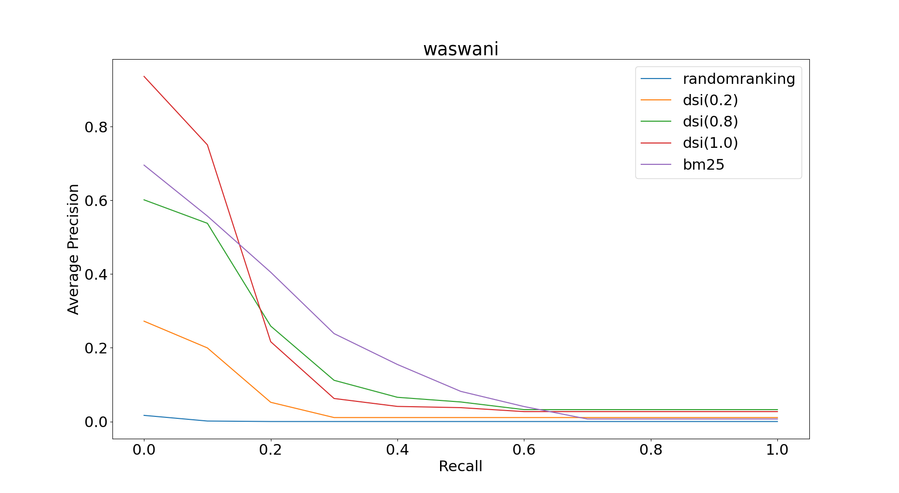
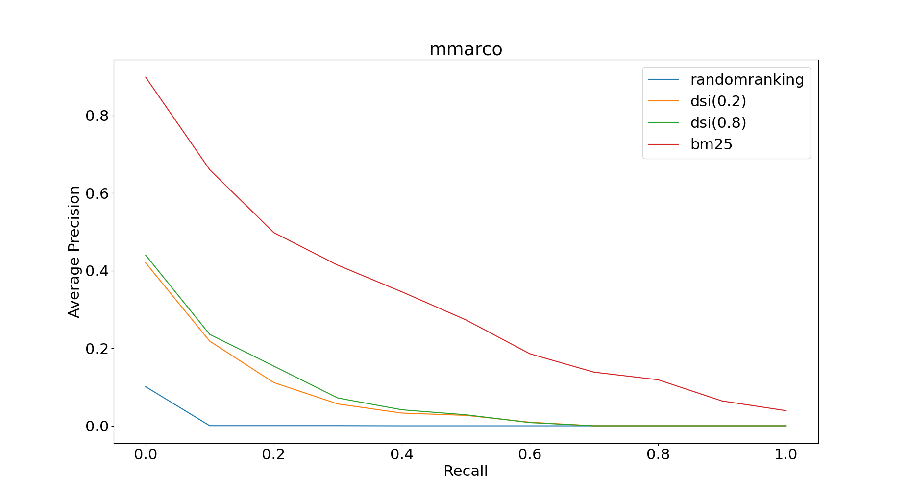
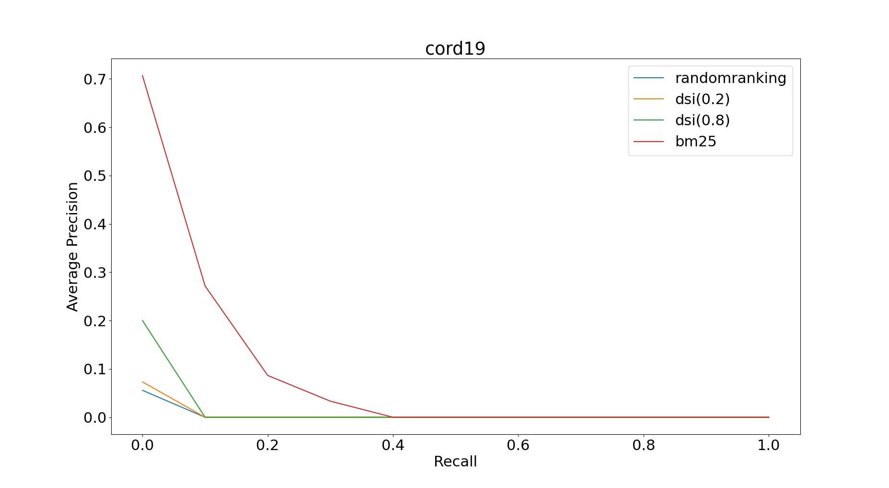
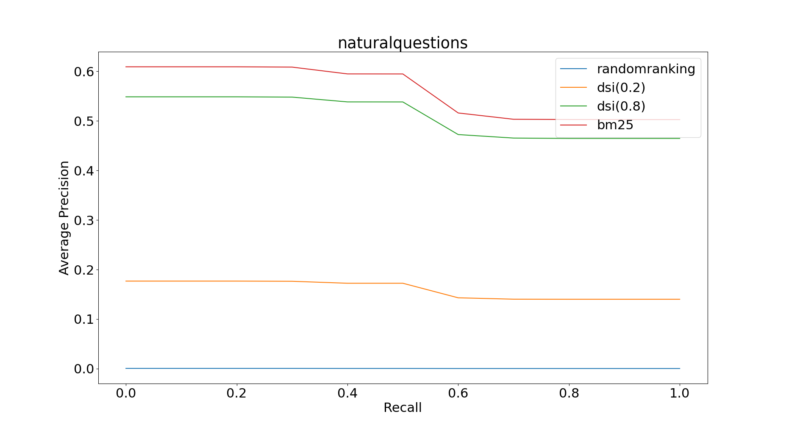

# DifferentiableSearchIndexAndRetrieval

According to the recent and novel studies, it has been shown that indexing and retrieval tasks in IR systems can be formulated as well-known machine learning problems and the whole process can be modeled with a transformer encoder-decoder system.  In this study, we employ a very recent neural network-based search indexing and retrieval method named "Differentiable Search Index". This method is capable of retrieving relevant documents by solely depending on their weight parameters in an end-to-end manner. We compare this method with the very known baseline method BM25 and the results will be compared with given metrics in 4 different datasets. 
  
## Installation
```
conda create -n dsi python=3.8
conda activate dsi
conda install pytorch torchvision torchaudio cudatoolkit=11.3 -c pytorch

conda install sentencepiece transformers==4.14.1 tokenizers==0.10.3 wandb nltk pytorch-lightning nlp jupyter matplotlib ipykernel flake8 gensim==3.* -c conda-forge
pip install ir_datasets
```

## Datasets

For the study, Vaswani, MMarco, Cord19 and Natural Questions datasets have been used. For the project scope, datasets are subsampled to smaller sets. Please download all of these files (~1GB) to the root folder of this repository. Download link: https://drive.google.com/drive/folders/1tx2R_PVV2J5nvUaNM-xbWzRSHFZCsiGX?usp=sharing

# Method

In DSI implementation, codes from m-shilpa (Reference: https://github.com/m-shilpa/Transformer_Memory_As_A_Differentiable_Search_Index) have been used as the foundation of the T5 transformer model&tokenizer. This repository uses huggingface tranformers library to download the pre-trained T5 model. After than, it fine tunes for indexing, retrieval and indexing_retrieval tasks defined as the original DSI paper.

For BM25 implementation, gensim library has been used. (Reference: https://github.com/RaRe-Technologies/gensim)

## Evaluation

Following measures have been implemented in order to compare DSI and BM25 methods:

- Hit@1
- Hit@10
- Precision@K
- Recall@K
- Mean Average precision (MAP)
- Mean Reciprocal Rank (MRR)

## Training

To train the DSI method with selected dataset, edit the relevant `DSI<MethodName>.py` file. To train, change the variable `RESUME_CHECKPOINT` to False. You can also change the parameter `QUERY_INSTANCE_RATIO_IN_TRAINING_DATA` to any ratio between 0 and 1 (default=0.8). 

After that, please execute the following lines (Natural Questions dataset is used as an example):

```
conda activate dsi
python DSINaturalQuestions.py
```

## Evaluation

To evaluate the DSI method with selected dataset, edit the relevant `DSI<MethodName>.py` file. To evaluate, change the variable `RESUME_CHECKPOINT` to True.

After that, please execute the following lines (Natural Questions dataset is used as an example):

```
conda activate dsi
python DSINaturalQuestions.py
```

## Results

Wasvani:



MMARCO:



CORD19:


NaturalQuestions:



